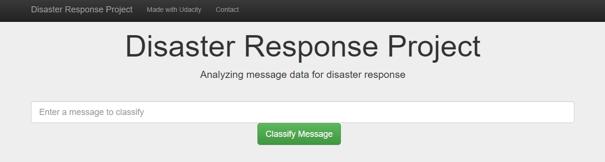

# Disaster Response Pipeline Project

### Table of Content

1. [Motivation](#motivation)
2. [Getting Started](#start)
    - [Packages](#packages)
    - [Structure](#structure)
    - [Instructions](#instructions)

3. [Licensing, Authors, Acknowledgements, etc.](#licensing-authors-acknowledgements-etc)

## Project Motivation

During disasters, emergency personel often need to make split second decisions. People are on high alert and share information through social networks at a blazing speed.
In this project, I applied my skills to analyze disaster data from [Figure Eight](https://appen.com/), building a model to classify diaster messages, to assist split second decision making.
This project incluides a web app for emergany worker to input new massages and help filter out irrelevant messages.

## Getting Started

Please fin below on how to get started with the project and how to interact with it.

### Packages

The following packages were used during this project.

- python 3.*
- pandas
- re
- json
- sklearn
- nltk
- sqlite3
- sqlalchemy
- pickle
- flask
- plotly

### Structure

The filestructure is set up as follows

	- README.md: read me file
    - \preparation
	    - ETL Pipeline Preparation.ipynb: contains ETL pipeline preparation code
	    - ML Pipeline Preparation.ipynb: contains ML pipeline preparation code
    - \app
        - run.py: flask file to run the app
    - \templates
        - master.html: main page of the web application 
        - go.html: result web page
    - \data
        - disaster_categories.csv: categories dataset
        - disaster_messages.csv: messages dataset
        - DisasterResponse.db: disaster response database
        - process_data.py: to run the ETL process
    - \models
        - train_classifier.py: training the classifier based on the responses in the Database

### Instructions:
Once downloaded, this is the way to get started: 
1. Run the following commands in the project's root directory to set up your database and model.

    - To run ETL pipeline that cleans data and stores in database
        `python data/process_data.py data/disaster_messages.csv data/disaster_categories.csv data/DisasterResponse.db`
    - To run ML pipeline that trains classifier and saves
        `python models/train_classifier.py data/DisasterResponse.db models/classifier.pkl`

2. Go to `app` directory: `cd app`

3. Run your web app: `python run.py`

4. Click the `PREVIEW` button to open the homepage

### Licensing, Authors, Acknowledgements, etc.
Thanks Udacity for providing the template for the webapp and the preparation for the files.